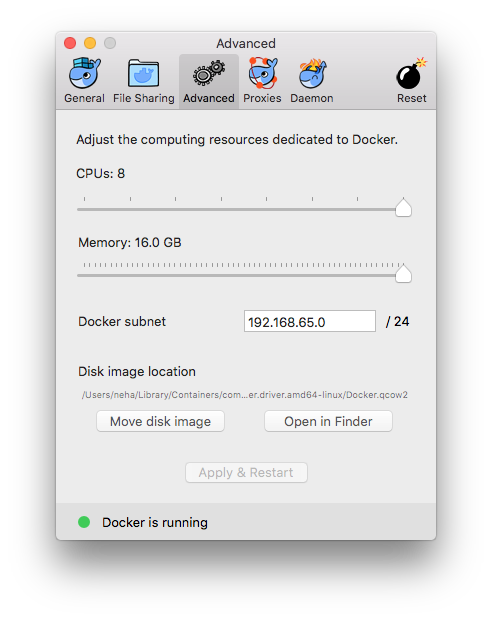
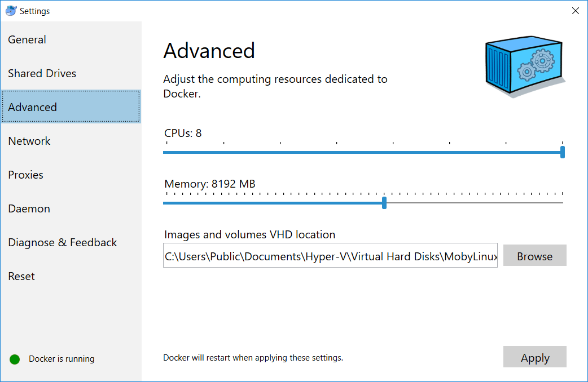

# Getting started

* [Installation](#installation)
  * [Prerequisites](#prerequisites)
    * [Mac OS](#mac-os)
    * [Windows](#windows)
    * [Linux](#linux)
  * [Downloading the AMP CLI](#downloading-the-amp-cli)
  * [Certificates](#certificates)
  * [Using the development version](#using-the-development-version)
* [Usage](#usage)
  * [Running AMP](#running-amp)
    * [Creating a local AMP cluster](#creating-a-local-amp-cluster)
    * [Creating an AMP cluster on AWS](#creating-an-amp-cluster-on-aws)
  * [Signing up and logging in](#signing-up-and-logging-in)
  * [Dashboard](#dashboard)
    * [Grafana](#grafana)
    * [Kibana](#kibana)
  * [Examples](#examples)
    * [Deploying a stack](#deploying-a-stack)
    * [Viewing and filtering logs](#viewing-and-filtering-logs)
    * [Team management](#team-management)

## Installation

### Prerequisites

We recommend installing the Docker CE stable channel release 17.09 on your system.
Make sure you check the `What to know before you install` section on the Docker site for Mac OS and Windows to ensure your system meets the requirements.
 * [What to know before you install - Docker for Mac](https://docs.docker.com/docker-for-mac/install/#what-to-know-before-you-install)
 * [What to know before you install - Docker for Windows](https://docs.docker.com/docker-for-windows/install/#what-to-know-before-you-install)
 
> NOTE: We currently do not support Docker Toolbox on any OS.

#### Mac OS

> NOTE: Please use the edge version for Mac.

For the installers, go to [Docker for Mac](https://docs.docker.com/docker-for-mac/install/).

Configure Docker to use maximum CPU and memory of at least 8 GB. You can configure settings by right clicking the whale icon on the status bar and clicking `Preferences` -> `Advanced`. 
Make sure you apply these changes for Docker to be configured with the new settings. 

Here is a sample Docker configuration on Mac OS.

 <p align="center">
   
 </p>

#### Windows

For the installers, go to [Docker for Windows](https://docs.docker.com/docker-for-windows/install/).

Configure Docker to use maximum CPU and memory of at least 8 GB. You can configure settings by right clicking the whale icon in the Notifications area and clicking `Settings` -> `Advanced`.
Make sure you apply these changes for Docker to be configured with the new settings. 

Here is a sample Docker configuration on a Windows machine.

 

#### Linux

You can find specific Linux distribution in the tables on [Docker for Linux](https://docs.docker.com/engine/installation/).

In addition, there is another step you must perform for your system to increase virtual memory (needed for Elasticsearch).

```
$ sudo sysctl -w vm.max_map_count=262144
```

To make this change permanent, you can run the following and reboot:
```
$ echo "vm.max_map_count = 262144" | sudo tee -a /etc/sysctl.conf
```

### Downloading the AMP CLI

Download the latest release of the CLI for your platform from [here](https://github.com/appcelerator/amp/releases).
Place the `amp` binary from the release archive into some location in your system path. 
For example:
```
$ sudo chmod +x ./amp
$ sudo mv ./amp /usr/local/bin
```

### Certificates

The connection between the CLI and the AMP server is secured with TLS. 
In case the certificate on the server is not valid (self signed or expired), you can use the `-k` option.
For local deployment, you can also add the certificate to your local key store.

> TIP: It would be useful to set an alias for `amp` as `alias amp='amp -k'`.

### Using the development version

Alternatively, if you wish to work with the latest development version directly from `master` on Github,
you can fork the repo and build your own CLI. The entire toolchain has been containerized so you only need to install Docker.

> TIP: Here is the official [Go documentation](https://golang.org/doc/code.html#Workspaces) explaining how to create a Go project structure and set GOPATH. 

To get the repo setup, you can run the following set of commands to clone the repository into your `go` workspace and add the CLI path to your system `PATH`.

```
$ cd $GOPATH/src
$ mkdir -p github.com/appcelerator
$ cd github.com/appcelerator
$ git clone https://github.com/appcelerator/amp
$ cd amp
$ export PATH=$GOPATH/src/github.com/appcelerator/amp/bin/{YourOS}/amd64:$PATH
```

To build the CLI and the core AMP images, you can then run:
```
$ ampmake build
```
This will build cross-compiled versions of the CLI and place them in the appropriate locations under `./bin`.
In addition, this will build the development versions of each of the images necessary for deployment of the AMP cluster.

## Usage

Run `amp --help` to get the CLI help menu for amp.

```
$ amp --help

Usage:	amp [OPTIONS] COMMAND

Deploy, manage, and monitor container stacks.

Examples:
amp version

Options:
  -h, --help            Print usage
  -k, --insecure        Control whether amp verifies the server's certificate chain and host name
  -s, --server string   Specify server (host:port)
  -v, --version         Print version information and quit

Management Commands:
  cluster      Cluster management operations
  config       Configuration management operations
  object-store Object storage operations
  password     Password management operations
  secret       Secret management operations
  service      Service management operations
  stack        Stack management operations
  team         Team management operations
  user         User management operations

Commands:
  completion   Output shell completion code for the specified shell (bash or zsh)
  login        Login to account
  logout       Logout of account
  logs         Display logs matching provided criteria
  settings     Display AMP settings
  version      Show version information
  whoami       Display currently logged in account name

Run 'amp COMMAND --help' for more information on a command.
```

> NOTE: A large number of AMP commands are interactive, so if necessary options are not provided
you will be prompted to provide them before the command runs.

### Running AMP

When using `amp`, every command takes the `--server|-s` option.
This option is used to define the target cluster you will be running your commands with.
The target server is displayed at the top of every CLI command output. 

> NOTE: If you have not added the AMP CLI path to your system PATH, you might encounter this error:
> ```
> $ amp version
> command not found: amp
> ```

For instance, if you are running a local cluster, the server information is displayed in the output of any AMP command that you execute.

```
$ amp version
[localhost:50101]

Client:
 Version:       0.18.0-dev
 Build:         27b1aabb
 Server:        localhost:50101
 Go version:    go1.9.2
 OS/Arch:       darwin/amd64

Server:         not connected
```

You can also add a default `--server|-s` value to your `amp.yml` settings file in `$HOME/.config/amp` directory.

For more information on creating your AMP settings file, see the [settings documentation](settings.md).

> NOTE: The server location of our hosted AMP is currently a work-in-progress.

The default value for the `--server|-s` option is `localhost:50101`, which points to a local
cluster that can be deployed on your system's Docker engine.

In order to make sure you're connected to the specified server when running commands,
you can run the `amp version` command to test this.

```
$ amp -s your.server.com version
[your.server.com:50101]
Client:
 Version:       v0.12.0-dev
 Build:         fe0947b5
 Server:        your.server.com:50101
 Go version:    go1.8.1
 OS/Arch:       darwin/amd64

Server:
 Version:       v0.12.0-dev
 Build:         fd732802
 Go version:    go1.8.1
 OS/Arch:       linux/amd64
```

> NOTE: The above example is just a sample of the output of `amp version` command. The output will vary according to the version of AMP used.

#### Creating a local AMP cluster

To create a new cluster on your local Docker system, run the following command:
```
$ amp cluster create
```

For more examples of cluster commands and deployment in different environments with different options, see the [cluster documentation](cluster.md).

#### Creating an AMP cluster on AWS

See the [AWS cluster documentation](awscluster.md) for detailed information on AMP cluster deployment on AWS.

### Signing up and logging in

In order to be able to use AMP, you will need to: 
* have a cluster running (on your local system or in the cloud) See [local cluster creation](cluster.md) or [AWS cluster creation](awscluster.md) for additional details.
* signup for a user account, verify the account and login.

> NOTE: Don't forget to specify your desired server target. For the purpose of illustration, we will use the local cluster (which is default) for running the AMP commands.

To signup:
```
$ amp user signup
username: sample
email: sample@user.com
password: [password]
```
After signing up, you will then be sent an email to your registered address. In this email, you will
be sent a link to verify your account with or you can verify your account with the provided CLI command.

> NOTE: The verification step is skipped for local deployment, you'll be logged in automatically.

To verify your account using the token in verification email:
```
$ amp user verify [token]
```
> NOTE: You need not verify your account on a local cluster.

To login to AMP:
```
$ amp login
username: sample
password: [password]
```

If you are having issues signing up or logging in, see the [user documentation](user.md).

For any password related operations, see the [password documentation](password.md)

Once you have successfully logged in to AMP, you will be able to deploy stacks, view logs and access dashboards.

### Dashboard

Along with our CLI, after deploying a cluster to your desired environment, you get access to Grafana Dashboard and Kibana Dashboard.

#### Grafana

local: http://dashboard.local.appcelerator.io

hosted: https://dashboard.YOUR.DOMAIN

#### Kibana

local:  http://kibana.local.appcelerator.io

hosted:  https://kibana.YOUR.DOMAIN

### Examples

#### Deploying a stack

To deploy a standard Docker Compose version 3 stackfile into your cluster, use `amp stack deploy`. See the [stacks documentation](stack.md) for more details.
There are a number of sample stackfiles under `examples/stacks` that you can try out.

> NOTE: In order to deploy a stack, you must have a running cluster and be logged in to AMP.

Here is a simple example:
```
$ amp stack deploy -c examples/stacks/pinger/pinger.yml
$ amp stack ls # You should see the pinger stack listed
$ amp service logs pinger # You should see the logs of the specified `pinger` service
$ curl http://pinger.examples.local.appcelerator.io/ping # You should receive response as `pong`
```
Or browse to: https://pinger.examples.local.appcelerator.io/ping

> TIP: If you encounter the following error with any AMP commands, make sure you specify `-k` option or simply set an alias for amp as alias amp = 'amp -k'.  
> ```
> $ amp stack deploy -c pinger.yml
> [user sample @ localhost:50101]
> Deploying stack pinger using pinger.yml
> Fatal:
> unable to establish grpc connection: x509: certificate is valid for *.local.appcelerator.io, not localhost
> ```

For more information on what you can do with your stack(s) when it is deployed, see the [stacks documentation](stack.md).

For more information on inspecting and manipulating the services within the deployed stack(s), see the [service documentation](service.md)

#### Viewing and filtering logs

The `amp logs` command allows for the querying and filtering of both real-time and historical logs.

To fetch the logs for your cluster:
```
$ amp logs
[user sample @ localhost:50101]
         pinger_pinger.2 | listening on :3000
         pinger_pinger.1 | listening on :3000
         pinger_pinger.3 | listening on :3000
```

Following on from the previous example of deploying a stack, if you want to fetch the logs of the `pinger` stack,
you can run:
```
$ amp stack logs pinger
[user sample @ localhost:50101]
         pinger_pinger.2 | listening on :3000
         pinger_pinger.1 | listening on :3000
         pinger_pinger.3 | listening on :3000
```
This will get the logs of every service in the stack.

If you want to get the logs for the individual services in the stack, you can run:
```
$ amp service logs pinger
[user sample @ localhost:50101]
         pinger_pinger.2 | listening on :3000
         pinger_pinger.1 | listening on :3000
         pinger_pinger.3 | listening on :3000
```

> NOTE: The above example is just a sample of the output of `amp logs` command and its sub-commands. The output may vary on different machines.

For more detailed examples of the querying and filtering options for logs, see the [logs documentation](logs.md)

#### Team management

Once you have signed up with `amp signup`, you will be automatically added to the default organization. As the first user,
you will become the `owner` of this organization. Within this organization, you can start creating individual teams of users and
associate resources, primarily stacks, with those teams.

> NOTE: Organization management features will be available in future releases.

To create an team:
```
$ amp team create samplers
[user sample @ localhost:50101]
Team has been created in the organization.
```
> NOTE: The majority of the team commands are interactive, you can look at the [team documentation](team.md) or the `--help`
option to see which commands take arguments or options.

After creating a team, you can add a resource to that team. Following on from the previous example, you can add your `pinger` stack to the team, as a resource, using its ID:
```
$ amp stack ls -q
[user sample @ localhost:50101]
faa4ef6e59f01d5de65e4a8059095d412b057b929c2cd47fbaa3f3a7d11e3e33
$ amp team resource add faa4ef6e59f01d5de6...
[user sample @ localhost:50101]
team name: samplers
Resource(s) have been added to team.
```
For more information on team management, see the [team documentation](team.md)
